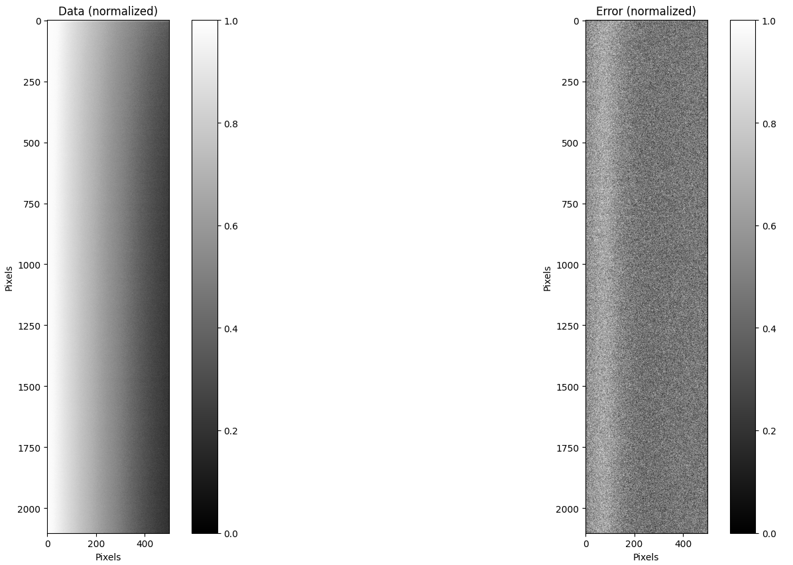
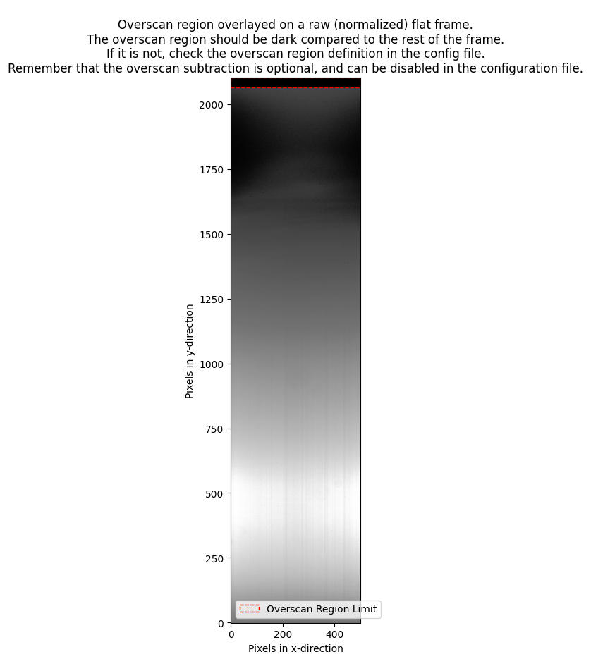

.. _bias:

Bias
====

Quickstart
-----------

The command for running the bias procedure is called by:

.. code-block:: bash

    pylongslit_bias PATH_TO_CONFIG_FILE

The bias procedure produces a master bias frame and places it in the 
output directory specified in the configuration file.

Overscan subtraction
^^^^^^^^^^^^^^^^^^^^
If overscan use is enabled in the configuration file, the bias procedure
will estimate a mean overscan bias individually for every raw bias frame 
and subtract it, before median combining the bias frames. In this case, 
the overscan bias is used as an estimate for the baseline bias-level frame-wise, while
the master bias frame is used to correct for the 2D bias structure/gradient 
through the detector. With ovsercan subtraction, the master bias can show negative values,
as these values correspond to an offset from the baseline bias-level, 
and not the absolute bias level.

Quality Assesment
^^^^^^^^^^^^^^^^^^

The bias procedure will show the final master bias and the error upon exiting. You can 
press ``h`` to normalize the master bias to see the structure of the bias
frame more clearly. How the bias should look like depends on the detector,
and most instruments have archived master bias frames that can be used as a reference.
Overall, you are expecting to see a smooth 2D structure (example of normalized master bias from the SDSS_J213510+2728
tutorial data):

Parameter options
------------------

The relevant parameters for the bias procedure are (with example values):

.. code::

    "detector": {
        "overscan" : {
            "use_overscan": true,
            "overscan_x_start": 0,
            "overscan_x_end": 499,
            "overscan_y_start": 2064,
            "overscan_y_end": 2102
        }
    }
    "bias": {
        "bias_dir": "/home/kostas/Documents/PyLongslit_dev/SDSS_J213510+2728/bias",
        "bootstrap_errors": false
    }

If you set ``"overscan_overscan": false``, the overscan subtraction will be skipped, 
and you do not need to worry about the rest of the overscan parameters. However, 
if you set ``"overscan_overscan": true``, you need to specify the overscan region
in the raw frames by definning a rectangular region with the parameters 
``"overscan_x_start"``, ``"overscan_x_end"``, ``"overscan_y_start"``, and ``"overscan_y_end"``,
with the orientation the raw data is provided in. You can call the command:

.. code-block:: bash

    pylongslit_check_config PATH_TO_CONFIG_FILE

in order to plot the defined overscan region on a raw flat-field frame 
(the example is from the SDSS_J213510+2728 tutorial data):

For the ``"bias_dir"`` parameter, you need to specify the path to the directory 
where the raw bias frames are stored. Make sure only bias frames are stored in this directory.

The ``"bootstrap_errors"`` parameter can be set to true in order to estimate the error on the
master bias frame using bootstrap resampling. This is useful if you have 
a small number of bias frames, and want to estimate the error with a higher
precission. However, the bootstrap resampling is computationally expensive,
and takes a while - specially for larger detectors. Whether bootstrap resampling is
necessary depends on the detector and your science case - if you do not 
need very high precission on the error, or if you know your detector has a 
stable bias level, you can mostly set ``"bootstrap_errors"`` to false. You can
read more about how the software estimates in the :ref:`chapter on uncertainties <uncertainties>`.