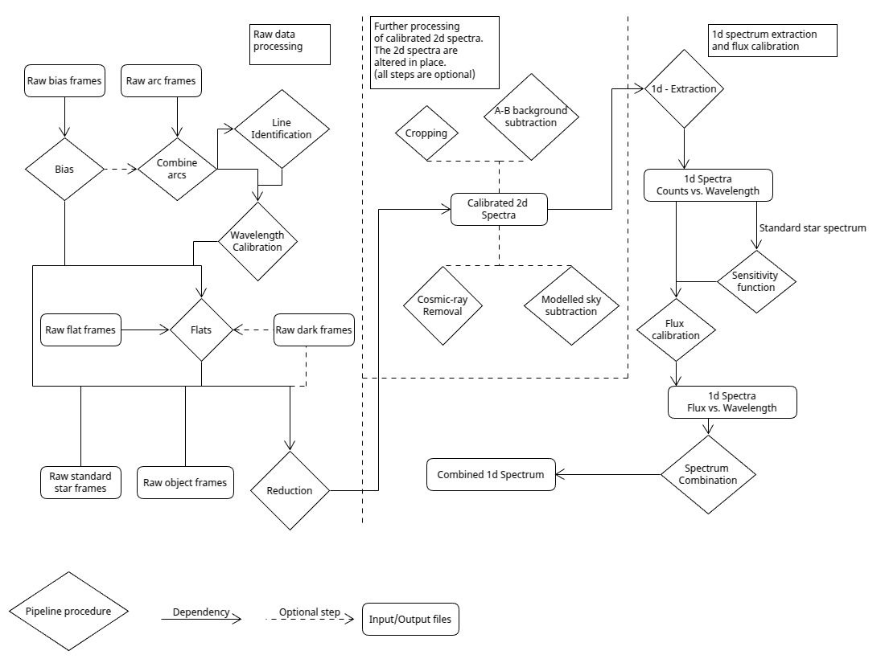

# Summary

We present a new Python pipeline for processing data from astronomical 
long-slit spectroscopy observations with CCD detectors.

The pipeine is designed to aim for **simplicity**, **manual execution**, **transparency** and **robustness**. The inspiration for the pipeline is to provide a manual and simple counterpart to the 
well-established semi-automated and automated pipelines. The intented use-cases are **teaching** and **edge-case observations**, where 
automated pipelines fail due to very low signal-to-noise ratio, several objects being very close 
on the detector and alike. For further elaboration,
please see the [Statement of need](#statement-of-need). 

From raw data, the
pipeline can produce the following output:

- A calibrated 2D spectrum in counts and wavelength for every detector pixel.
- A 1D spectrum extracted from the 2D spectrum in counts per wavelength (for point-like objects).
- A flux-calibrated 1D spectrum in $\frac{\text{erg}}{\text{s} \cdot \text{cm}^2 \cdot \text{Å}}$ (for point-like objects).

The products are obtained by performing standard procedures for
detector calibrations [@handbook] [@Howell_2006], comsic-ray subtraction [@cr_1] [@cr_2]
, and 1D spectrum extraction [@Horne_1986] [@photutils].   

# Statement of need

A natural approach when developing data-precessing pipelines is to seek for precision and automation. The trade-off for this 
is code complexity and "black-box" solutions, where the process of the pipeline is often masked, and 
the quality-assesment output is made under the assumtpiton that the user knows how to interpret it. 
In research, this is a reasonable trade-off, as a certain level of user-skill and experience can be assumed. However, 
in a teaching paradigm, simplicity and transparency are often more favorable, even when this means loss of 
precision and automation. The PyLongslit pipeline is designed to rely on simple code and manual execution,
supported by a large array of quality-assesment plots and extensive documentation. The algortihms are designed to produce research-quality results, yet while prioritizing simplicity over high precission. The reason for this is 
to create a robust and transparent pipeline, where every step of the execution is visualized and explained. We see this as being specially valuable in teaching scenarios and for users that 
are new to spectroscopic data processing. Furthermore, we hope that 
the simple coding style will invite users of all skill-levels to contribute to the code.

An early beta-version of the software was user-tested during the Nordic Optical Telescope[^1] IDA summer-course 
2024[^2], where all student groups where able to follow the documentation and succesfully process data 
without any significant assistance. 

During the developtment of software it became apparent that the manual nature of the pipeline is 
also useful for observations where automated pipelines might fail. The PyLongslit pipeline can revert to manual methods instead of using mathematical modelling when estimating the observed object trace on the 
detector. This is specially useful for objects
that have low signal-to-noise ratio, or where several objects are very close to each onther on the detector.   

[^1]:  https://www.not.iac.es/
[^2]: https://phys.au.dk/ida/events/not-summer-school-2024

# Pipeline

# Limitations

# Acknowledgements

# References
